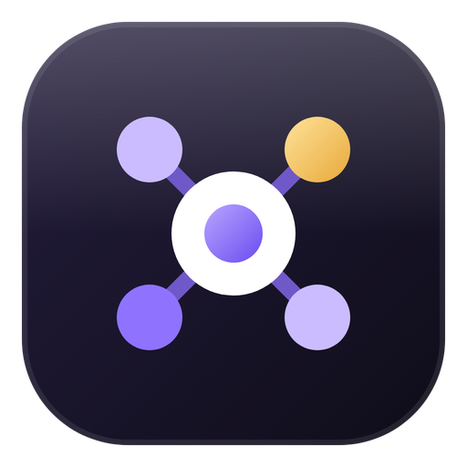
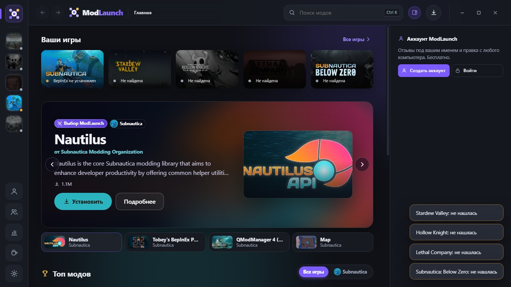
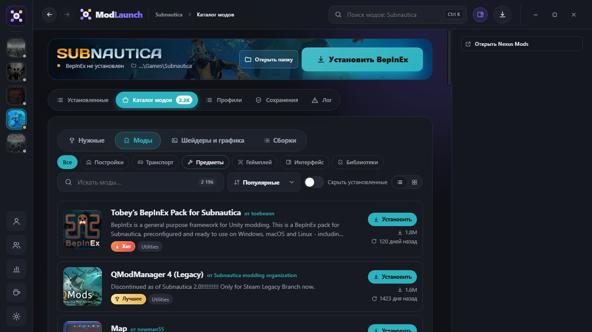
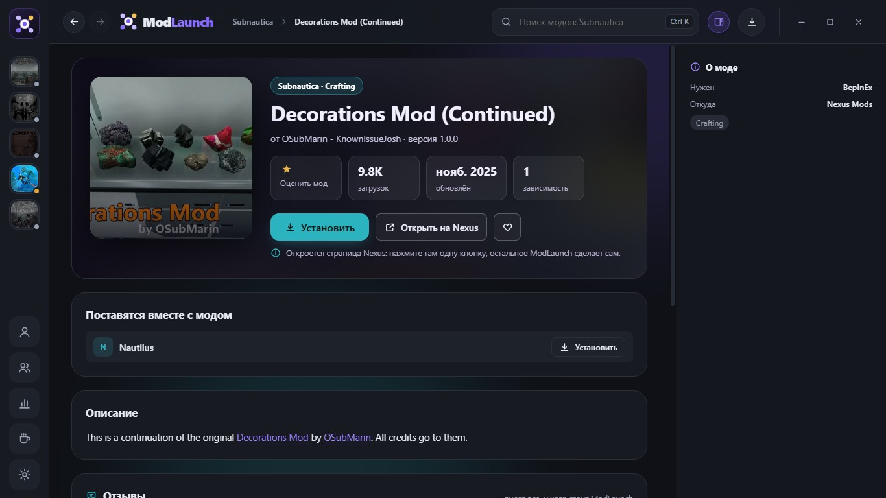
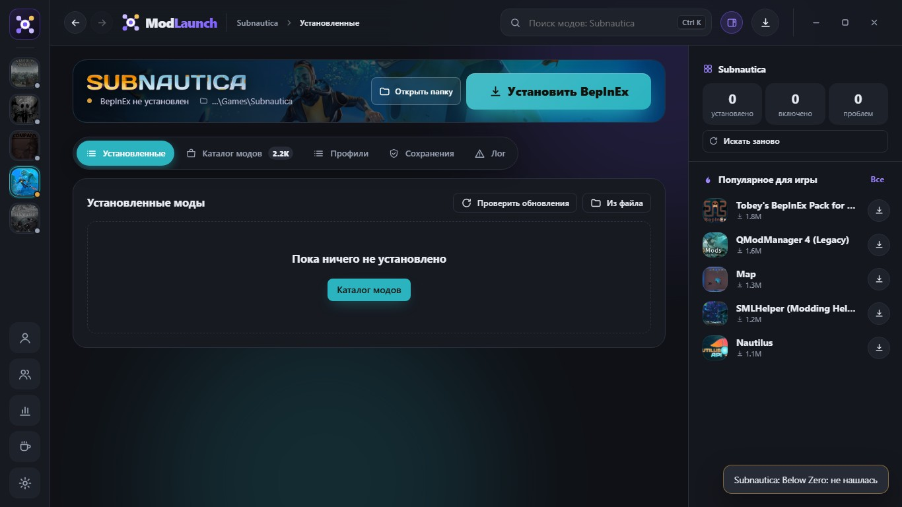
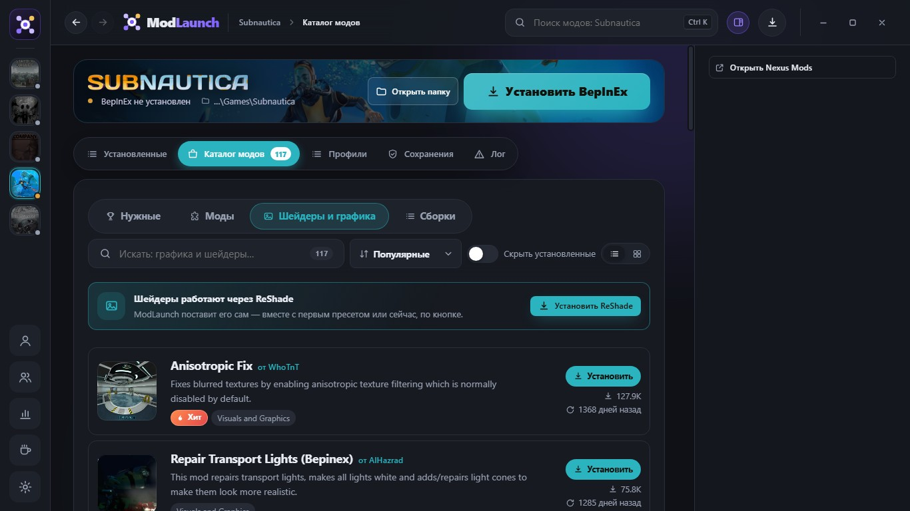
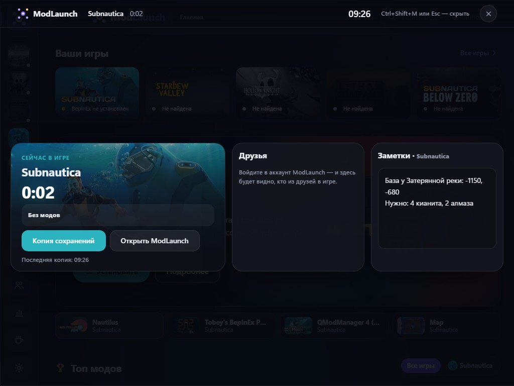
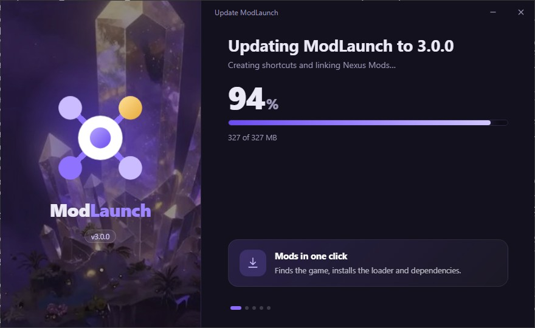

# ModLaunch

**Mods in one click, no guide needed.**
ModLaunch finds your game, installs the mod loader and downloads mods together with their dependencies.

**English** · [Русский](README.ru.md)

## Supported games

| Game | Mod loader (installed automatically) | Where mods come from |
| --- | --- | --- |
| Stardew Valley | SMAPI | Nexus Mods |
| Hollow Knight | Modding API | Hollow Knight community mod list |
| Lethal Company | BepInEx | Thunderstore |
| Subnautica | BepInEx | Thunderstore, Nexus Mods |
| Subnautica: Below Zero | BepInEx | Thunderstore, Nexus Mods |
| Valheim | BepInEx | Thunderstore |
| Risk of Rain 2 | BepInEx | Thunderstore |

Steam, Epic, GOG and standalone copies are found automatically. If a game isn't found, point ModLaunch to its folder once.

## Download and install

1. Open the [latest release](https://github.com/ModLaunch/ModLaunch/releases/latest).
2. Under **Assets**, download **`ModLaunch-Setup-<version>.exe`**.
3. Run it and press **Install**. ModLaunch appears on the desktop and in the Start menu.

Prefer no installation? Download **`ModLaunch-<version>-win-x64.zip`**, unzip it anywhere and run `ModLaunch.exe`.

### "Windows protected your PC"

ModLaunch is a free project and isn't signed with a paid code-signing certificate yet, so Windows SmartScreen may show a blue warning the first time you run it. This is normal for small indie apps.

1. Click **More info**.
2. Click **Run anyway**.

You only need to do this once. Updates are installed by ModLaunch itself.

## Features

- **One-click installs.** Pick a mod and press *Install*. The loader and all required dependencies are installed with it.
- **Catalogue with sections:** Essentials, Mods (buildings, vehicles, items, gameplay, UI, libraries…), Shaders & graphics, Modpacks.
- **Mod management:** turn mods on and off without deleting them, check for mod updates, mod profiles and modpacks you can share as a file.
- **Save backups** before every game launch.
- **Shaders:** ReShade is installed for you, presets go straight into the game folder.
- **Nexus collections and Thunderstore modpacks** install as a whole, in exactly the versions the author picked. With Nexus Premium it's fully automatic; without it ModLaunch opens each mod page in turn and installs what you download.
- **DXVK for any older game** (Settings → Graphics): pick the game's exe, ModLaunch detects 32/64-bit and the DirectX version, installs the latest DXVK and removes it with one click, restoring the original files.
- **Friends:** add friends by code and see who is online and what they're playing.
- **In-game overlay** (Ctrl+Shift+M): session time, friends, save backup and notes for the game.
- **Reviews and ratings** for mods, shared between all ModLaunch users.
- **Auto-update:** new versions of ModLaunch download and install themselves.
- **Interface in English and Russian.**

## Screenshots

| Mod catalogue | Mod page |
| --- | --- |
|  |  |

| Game page | Shaders & graphics |
| --- | --- |
|  |  |

| In-game overlay | Installer |
| --- | --- |
|  |  |

## FAQ

**Is it free?**
Yes.

**Does ModLaunch host mods?**
No. Files are downloaded directly from where their authors published them: Thunderstore, the Hollow Knight community mod list, Nexus Mods and GitHub. All rights to each mod belong to its author.

**Why does Nexus Mods need an extra click?**
Nexus Mods gives files to free accounts only from its own website. ModLaunch opens the mod's page, you press *Slow download* there, and ModLaunch picks the file up from your Downloads folder and installs it by itself. No API key needed.

**How do I uninstall it?**
Windows Settings → Apps → ModLaunch → Uninstall.

**Something broke. What do I do?**
Open an [issue](https://github.com/ModLaunch/ModLaunch/issues) and describe what happened. A screenshot of the *Log* tab on the game page helps a lot.

## License

Copyright © 2026 the ModLaunch author. All rights reserved. See [LICENSE](LICENSE).
You're welcome to download and use ModLaunch for free. The source code is published for transparency, not for reuse.

Developer notes: [docs/DEVELOPMENT.md](docs/DEVELOPMENT.md) (in Russian).
